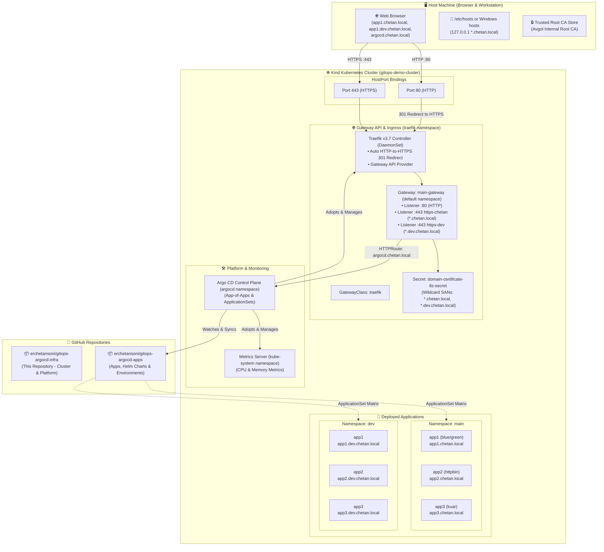

# ☸️ GitOps Kubernetes Infrastructure & Platform Control Plane

[](https://kubernetes.io/)
[](https://kind.sigs.k8s.io/)
[](https://traefik.io/)
[](https://gateway-api.sigs.k8s.io/)
[](https://argo-cd.readthedocs.io/)

This repository (**`erchetansoni/gitops-argocd-infra`**) is the declarative infrastructure and platform control plane for the GitOps Kubernetes environment. It provisions the cluster foundation, ingress/gateway controller, internal PKI/TLS certificates, platform services, and Argo CD.

Workload microservices and per-environment manifests live in the companion repository:  
👉 **[`erchetansoni/gitops-argocd-apps`](https://github.com/erchetansoni/gitops-argocd-apps)**

---

## 🏛️ High-Level GitOps Architecture



---

## 📂 Repository Directory Layout

Each numbered directory encapsulates a specific stage of the platform bootstrap lifecycle:

| Directory | Purpose | Key Manifests & Scripts |
| :--- | :--- | :--- |
| **[`01-create-cluster`](file:///c:/Projects/My_Projects/GitOps-demo/01-create-cluster/README.md)** | Local Kind Kubernetes cluster | `kind-cluster-config.yaml`, `create-cluster.sh` |
| **[`02-Traefik-Gateway-Controller`](file:///c:/Projects/My_Projects/GitOps-demo/02-Traefik-Gateway-Controller/README.md)** | Gateway API CRDs & Traefik v3 DaemonSet | `install-traefik-gateway-controller.sh`, `traefik-values.yaml` |
| **[`03-Traefik-Gateway-Class`](file:///c:/Projects/My_Projects/GitOps-demo/03-Traefik-Gateway-Class/README.md)** | GatewayClass, Gateway listeners & TLS | `install-gatewayclass_and_gateway.yaml`, `cert/tls-generator/` |
| **[`04-infra-apps`](file:///c:/Projects/My_Projects/GitOps-demo/04-infra-apps/README.md)** | Platform infra apps (Traefik & Metrics Server) | `infra-apps-root.yaml`, `01-traefik-gateway/`, `02-metrics-server/` |
| **[`05-argocd`](file:///c:/Projects/My_Projects/GitOps-demo/05-argocd/README.md)** | Argo CD install, ConfigMaps, HTTPRoute & adoption | `01-install-argocd.sh`, `02-adopt-infra-apps.sh`, `argocd-httproute.yaml` |
| **[`06-apps`](file:///c:/Projects/My_Projects/GitOps-demo/06-apps/README.md)** | Workload Git repo credentials & Root ApplicationSet | `01-install-repo-creds-secret.sh`, `02-install-root-app.sh`, `root-app/` |

---

## 📋 Prerequisites

Before running the bootstrap scripts, ensure your workstation has:

1. **Docker Desktop** (or Docker Engine) running.
2. **[Kind CLI](https://kind.sigs.k8s.io/)** (`kind version >= 0.20`).
3. **[kubectl](https://kubernetes.io/docs/tasks/tools/)** (`>= v1.28`).
4. **[Helm 3](https://helm.sh/)** (`>= v3.12`).
5. **OpenSSL** (available via Git Bash or Linux).
6. **Bash shell** (Git Bash on Windows or native bash on Linux/macOS).

---

## 🚀 End-to-End Setup Guide

Follow the sequence from `01` to `06` to stand up the entire platform:

### Step 1: Create the Kind Cluster
```bash
bash 01-create-cluster/create-cluster.sh
```
* Provisions `gitops-demo-cluster` with ports `80` and `443` bound to your localhost.

### Step 2: Install Traefik Gateway API Controller
```bash
bash 02-Traefik-Gateway-Controller/install-traefik-gateway-controller.sh
```
* Installs standard Gateway API CRDs (`v1.6.2`).
* Deploys Traefik v3 DaemonSet with entrypoint HTTP-to-HTTPS redirect enabled.

### Step 3: Deploy GatewayClass, Gateway & TLS Certificates
```bash
bash 03-Traefik-Gateway-Class/install-traefik-gatewayclass.sh
```
* Generates private Root CA and wildcard certificate with SANs (`*.chetan.local`, `*.dev.chetan.local`).
* Creates `domain-certificate-tls-secret` in namespace `default`.
* Creates GatewayClass `traefik` and Gateway `main-gateway`.

### Step 4: Install Argo CD & Expose UI
```bash
bash 05-argocd/01-install-argocd.sh
```
* Installs Argo CD in `argocd` namespace.
* Applies enterprise ConfigMaps (`server.insecure: true`, Kustomize build options, HTTPRoute ignoreDifferences).
* Creates Gateway API route `argocd-server-route` for `https://argocd.chetan.local`.

### Step 5: Adopt Platform Infrastructure Apps
```bash
bash 05-argocd/02-adopt-infra-apps.sh
```
* Seamlessly transfers ownership of Traefik and Metrics Server to Argo CD without terminating running pods.

### Step 6: Connect Workload Repo & Deploy ApplicationSet
```bash
# 1. Configure GitHub token in .env:
cp 06-apps/.env.example 06-apps/.env
# Edit 06-apps/.env with your GitHub Personal Access Token (PAT)

# 2. Apply GitHub repo credentials secret:
bash 06-apps/01-install-repo-creds-secret.sh

# 3. Deploy the root Matrix ApplicationSet:
bash 06-apps/02-install-root-app.sh
```
* Argo CD connects to `https://github.com/erchetansoni/gitops-argocd-apps.git`.
* Discovers all environment folders (`environments/main`, `environments/dev`) and deploys all application microservices automatically.

---

## 🌐 DNS & Local Domain Configuration

Add the following mappings to your local hosts file:
* **Windows**: `C:\Windows\System32\drivers\etc\hosts` (run Notepad as Administrator)
* **Linux / macOS**: `/etc/hosts`

```text
127.0.0.1 argocd.chetan.local
127.0.0.1 app1.chetan.local
127.0.0.1 app2.chetan.local
127.0.0.1 app3.chetan.local
127.0.0.1 app1.dev.chetan.local
127.0.0.1 app2.dev.chetan.local
127.0.0.1 app3.dev.chetan.local
```

---

## 🔒 Trusting the Root CA (Green Lock in Browser)

To eliminate browser security warnings on `*.chetan.local` and `*.dev.chetan.local`:

1. Locate the Root CA certificate:
   [`03-Traefik-Gateway-Class/cert/tls-generator/client/rootCA.crt`](file:///c:/Projects/My_Projects/GitOps-demo/03-Traefik-Gateway-Class/cert/tls-generator/client/rootCA.crt)
2. Double-click the file -> **Install Certificate...** -> select **Local Machine** -> **Next**.
3. Choose **Place all certificates in the following store** -> click **Browse**.
4. Select **Trusted Root Certification Authorities** -> **OK** -> **Finish**.
5. Restart your browser.

---

## 🔍 Verification & Inspection Commands

```bash
# Check all Argo CD Applications
kubectl get applications -n argocd

# Check Gateway and HTTPRoutes
kubectl get gateway,httproute -A

# Test HTTP to HTTPS redirection (returns HTTP 301)
curl -s -D - -H "Host: app1.chetan.local" http://127.0.0.1/
curl -s -D - -H "Host: app1.dev.chetan.local" http://127.0.0.1/

# Test HTTPS endpoints directly
curl -k https://app1.chetan.local/
curl -k https://app1.dev.chetan.local/
curl -k https://argocd.chetan.local/
```

---

## 🤝 Companion Repository

To configure applications, modify Helm values, or create new environment branches (`dev`, `staging`, `prod`), refer to:  
👉 **[`erchetansoni/gitops-argocd-apps`](https://github.com/erchetansoni/gitops-argocd-apps)**
