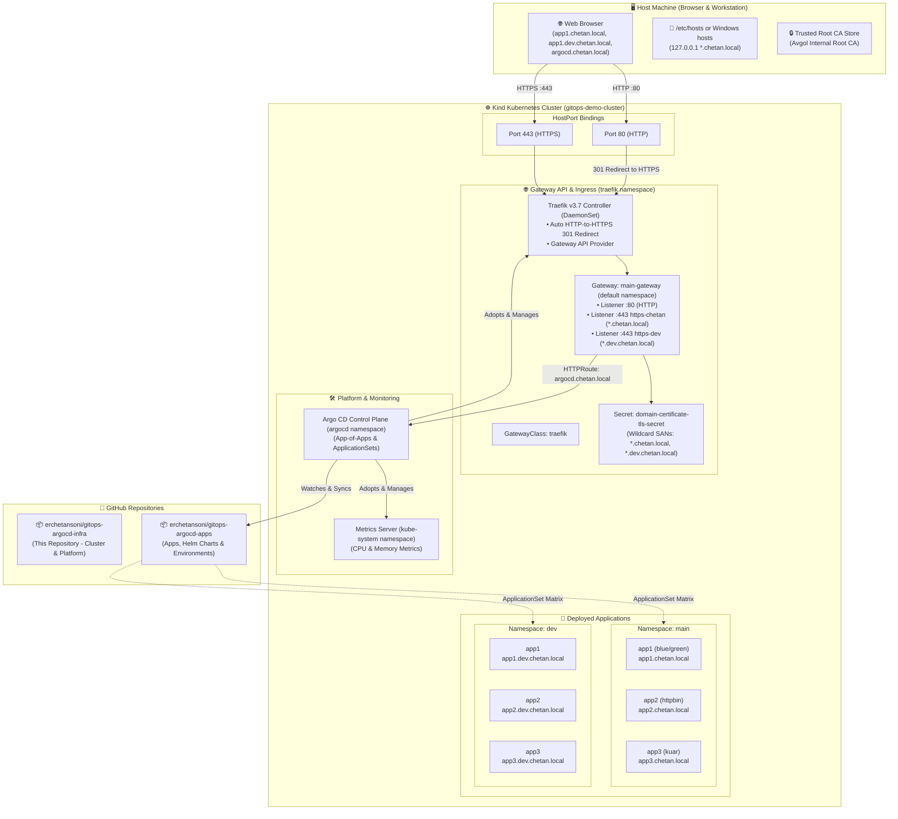

# ☸️ GitOps Kubernetes Infrastructure & Platform Control Plane

[](https://kubernetes.io/)
[](https://kind.sigs.k8s.io/)
[](https://traefik.io/)
[](https://gateway-api.sigs.k8s.io/)
[](https://argo-cd.readthedocs.io/)

This repository (**`erchetansoni/gitops-argocd-infra`**) is the declarative infrastructure and platform control plane for the GitOps Kubernetes environment. It provisions the cluster foundation, ingress/gateway controller, internal PKI/TLS certificates, platform services, and Argo CD.

Workload microservices and per-environment manifests live in the companion repository:  
👉 **[`erchetansoni/gitops-argocd-apps`](https://github.com/erchetansoni/gitops-argocd-apps)**

---

## 🏛️ High-Level GitOps Architecture



---

## 📂 Repository Directory Layout

Each numbered directory encapsulates a specific stage of the platform bootstrap lifecycle:

| Directory | Purpose | Key Manifests & Scripts |
| :--- | :--- | :--- |
| **[`01-create-cluster`](file:///c:/Projects/My_Projects/gitops-argocd-infra/01-create-cluster/README.md)** | Local Kind Kubernetes cluster | `kind-cluster-config.yaml`, `create-cluster.sh` |
| **[`02-traefik-controller`](file:///c:/Projects/My_Projects/gitops-argocd-infra/02-traefik-controller/README.md)** | Gateway API CRDs & Traefik v3 DaemonSet | `install-traefik-gateway-controller.sh`, `traefik-values.yaml` |
| **[`03-cert-manager`](file:///c:/Projects/My_Projects/gitops-argocd-infra/03-cert-manager/README.md)** | cert-manager v1.21.2 & ClusterIssuer | `install-cert-manager.sh`, `cluster-issuer.yaml` |
| **[`04-traefik-gateway`](file:///c:/Projects/My_Projects/gitops-argocd-infra/04-traefik-gateway/README.md)** | GatewayClass, Gateway listeners & TLS Certificate | `install-gatewayclass_and_gateway.yaml`, `cert/tls-generator/` |
| **[`05-infra-apps`](file:///c:/Projects/My_Projects/gitops-argocd-infra/05-infra-apps/README.md)** | Platform infra apps (Traefik, Metrics Server, cert-manager) | `infra-apps-root.yaml`, `01-traefik-gateway/`, `02-metrics-server/` |
| **[`06-argocd`](file:///c:/Projects/My_Projects/gitops-argocd-infra/06-argocd/README.md)** | Argo CD install, ConfigMaps, HTTPRoute & adoption | `01-install-argocd.sh`, `02-adopt-infra-apps.sh`, `argocd-httproute.yaml` |
| **[`07-apps`](file:///c:/Projects/My_Projects/gitops-argocd-infra/07-apps/README.md)** | Workload Git repo credentials & Root ApplicationSet | `01-install-repo-creds-secret.sh`, `02-install-root-app.sh`, `root-app/` |

---

## 📋 Prerequisites

Before running the bootstrap scripts, ensure your workstation has:

1. **Docker Desktop** (or Docker Engine) running.
2. **[Kind CLI](https://kind.sigs.k8s.io/)** (`kind version >= 0.20`).
3. **[kubectl](https://kubernetes.io/docs/tasks/tools/)** (`>= v1.28`).
4. **[Helm 3](https://helm.sh/)** (`>= v3.12`).
5. **OpenSSL** (available via Git Bash or Linux).
6. **Bash shell** (Git Bash on Windows or native bash on Linux/macOS).

---

## 🚀 End-to-End Setup Guide

Follow the sequence from `01` to `07` to stand up the entire platform:

### Step 1: Create the Kind Cluster
```bash
bash 01-create-cluster/create-cluster.sh
```
* Provisions `gitops-demo-cluster` with ports `80` and `443` bound to your localhost.

### Step 2: Install Traefik Gateway API Controller
```bash
bash 02-traefik-controller/install-traefik-gateway-controller.sh
```
* Installs standard Gateway API CRDs (`v1.6.2`).
* Deploys Traefik v3 DaemonSet with entrypoint HTTP-to-HTTPS redirect enabled.

### Step 3: Install cert-manager & ClusterIssuer
```bash
bash 03-cert-manager/install-cert-manager.sh
```
* Deploys cert-manager `v1.21.2` with CRDs and Gateway API integration.
* Injects Root CA into `local-root-ca-secret` and configures `ClusterIssuer/local-ca-issuer`.

### Step 4: Deploy GatewayClass, Gateway & TLS Certificate
```bash
bash 04-traefik-gateway/install-traefik-gatewayclass.sh
```
* Deploys GatewayClass `traefik` and Gateway `main-gateway`.
* Declares `Certificate/domain-wildcard-cert`, which cert-manager automatically signs and populates into `domain-certificate-tls-secret`.

### Step 5: Install Metrics Server
```bash
bash 05-infra-apps/02-metrics-server/install-metrics-server.sh
```
* Installs Metrics Server for cluster resource metrics (`kubectl top nodes`, `kubectl top pods`).

### Step 6: Install Argo CD & Expose UI
```bash
bash 06-argocd/01-install-argocd.sh
bash 06-argocd/02-adopt-infra-apps.sh
```
* Installs Argo CD in `argocd` namespace and exposes UI via `https://argocd.chetan.local`.
* Adopts Traefik, Metrics Server, and cert-manager into declarative GitOps control.

### Step 7: Connect Workload Repo & Deploy ApplicationSet
```bash
# 1. Configure GitHub token in .env:
cp 07-apps/.env.example 07-apps/.env
# Edit 07-apps/.env with your GitHub Personal Access Token (PAT)

# 2. Apply GitHub repo credentials secret:
bash 07-apps/01-install-repo-creds-secret.sh

# 3. Deploy the root Matrix ApplicationSet:
bash 07-apps/02-install-root-app.sh
```
* Argo CD connects to `https://github.com/erchetansoni/gitops-argocd-apps.git`.
* Discovers all environment folders (`environments/main`, `environments/dev`) and deploys all application microservices automatically.

---

## 🌐 DNS & Local Domain Configuration

Add the following mappings to your local hosts file:
* **Windows**: `C:\Windows\System32\drivers\etc\hosts` (run Notepad as Administrator)
* **Linux / macOS**: `/etc/hosts`

```text
127.0.0.1 argocd.chetan.local
127.0.0.1 app1.chetan.local
127.0.0.1 app2.chetan.local
127.0.0.1 app3.chetan.local
127.0.0.1 app1.dev.chetan.local
127.0.0.1 app2.dev.chetan.local
127.0.0.1 app3.dev.chetan.local
```

---

## 🔒 Trusting the Root CA (Green Lock in Browser)

To eliminate browser security warnings on `*.chetan.local` and `*.dev.chetan.local`:

1. Locate the Root CA certificate:
   [`04-traefik-gateway/cert/tls-generator/client/rootCA.crt`](file:///c:/Projects/My_Projects/gitops-argocd-infra/04-traefik-gateway/cert/tls-generator/client/rootCA.crt)
2. Double-click the file -> **Install Certificate...** -> select **Local Machine** -> **Next**.
3. Choose **Place all certificates in the following store** -> click **Browse**.
4. Select **Trusted Root Certification Authorities** -> **OK** -> **Finish**.
5. Restart your browser.

---

## 🔍 Verification & Inspection Commands

```bash
# Check all Argo CD Applications
kubectl get applications -n argocd

# Check Gateway and HTTPRoutes
kubectl get gateway,httproute -A

# Test HTTP to HTTPS redirection (returns HTTP 301)
curl -s -D - -H "Host: app1.chetan.local" http://127.0.0.1/
curl -s -D - -H "Host: app1.dev.chetan.local" http://127.0.0.1/

# Test HTTPS endpoints directly
curl -k https://app1.chetan.local/
curl -k https://app1.dev.chetan.local/
curl -k https://argocd.chetan.local/
```

---

## 🌍 Multi-Cloud & On-Premises Deployment Guide

While this repository defaults to a local **KinD** cluster with Docker port-mapping, the Gateway API and GitOps structure seamlessly scale to multi-node clusters across **AWS**, **GCP**, and on-premises **Proxmox VE**.

### Summary of Differences Across Targets

| Feature | KinD (Local Dev) | GCP (GKE) | AWS (EKS) | Proxmox VE (Bare-metal / VMs) |
| :--- | :--- | :--- | :--- | :--- |
| **Cluster Topology** | 1 Docker node | 3+ GKE worker nodes | 3+ EKS worker nodes | 3+ VMs (e.g. Talos / k3s / kubeadm) |
| **Service Type** | `ClusterIP` + `hostPort: 80/443` | `LoadBalancer` (Cloud NLB) | `LoadBalancer` (AWS NLB) | `LoadBalancer` (via MetalLB or Cilium BGP) |
| **Traefik hostPort** | `80` & `443` enabled | Disabled | Disabled | Optional (or use MetalLB VIP) |
| **External Access / IP** | `127.0.0.1` | GCP External Static/Ephemeral IP | AWS NLB DNS name (`*.elb.amazonaws.com`) | Dedicated LAN VIP (e.g. `192.168.1.200`) |
| **DNS Resolution** | Workstation `/etc/hosts` | Cloud DNS (`*.yourdomain.com` -> IP) | Route 53 (`*.yourdomain.com` -> NLB) | Pi-hole / pfSense / Local DNS Server |
| **TLS Certificates** | Self-signed Root CA (`03-Traefik...`) | `cert-manager` + Let's Encrypt | `cert-manager` or AWS ACM | `cert-manager` (Let's Encrypt via DNS-01) |

---

### 1. ☁️ Google Cloud Platform (GCP - GKE)

1. **Traefik Service (`traefik-values.yaml`)**:
   Set `service.spec.type: LoadBalancer` and remove `hostPort`. GCP will provision a Passthrough Network Load Balancer (TCP):
   ```yaml
   service:
     enabled: true
     spec:
       type: LoadBalancer
       externalTrafficPolicy: Local
   ports:
     web:
       port: 80
       containerPort: 80
       exposedPort: 80
       # hostPort: 80   <-- Remove
     websecure:
       port: 443
       containerPort: 443
       exposedPort: 443
       # hostPort: 443  <-- Remove
   ```

2. **DNS & TLS**:
   * Get the external IP via `kubectl get svc traefik -n traefik`.
   * In **Google Cloud DNS**, create a wildcard `A` record: `*.yourdomain.com` pointing to the LoadBalancer IP.
   * Deploy `cert-manager` with a Let's Encrypt `ClusterIssuer` using the GCP Cloud DNS solver.

---

### 2. 🟧 Amazon Web Services (AWS - EKS)

1. **Traefik Service (`traefik-values.yaml`)**:
   Deploy the [AWS Load Balancer Controller](https://kubernetes-sigs.github.io/aws-load-balancer-controller/) and annotate the service for an external Network Load Balancer (NLB):
   ```yaml
   service:
     enabled: true
     spec:
       type: LoadBalancer
       annotations:
         service.beta.kubernetes.io/aws-load-balancer-type: "external"
         service.beta.kubernetes.io/aws-load-balancer-nlb-target-type: "ip"
         service.beta.kubernetes.io/aws-load-balancer-scheme: "internet-facing"
   ```

2. **DNS & TLS**:
   * In **Route 53**, create an `A` (Alias) record: `*.yourdomain.com` pointing to the AWS NLB DNS.
   * Traefik can terminate TLS using a wildcard cert issued via `cert-manager` (Route 53 DNS-01 challenge) or offload TLS directly at the NLB using AWS Certificate Manager (ACM).

---

### 3. 🖥️ Proxmox VE (HomeLab / Private Cloud)

When running a 3-node Kubernetes cluster inside Proxmox (e.g., using **Talos Linux**, **k3s**, or **Ubuntu + kubeadm** VMs):

1. **Bare-metal Load Balancer (MetalLB / Cilium)**:
   Proxmox does not natively provide a cloud load balancer. Install **[MetalLB](https://metallb.io/installation/)** in Layer 2 mode to assign IPs from your home/homelab subnet:
   ```yaml
   apiVersion: metallb.io/v1beta1
   kind: IPAddressPool
   metadata:
     name: proxmox-ip-pool
     namespace: metallb-system
   spec:
     addresses:
       - 192.168.1.200-192.168.1.210  # Range on your Proxmox LAN
   ---
   apiVersion: metallb.io/v1beta1
   kind: L2Advertisement
   metadata:
     name: proxmox-l2-advert
     namespace: metallb-system
   ```

2. **Traefik Service (`traefik-values.yaml`)**:
   ```yaml
   service:
     enabled: true
     spec:
       type: LoadBalancer
       loadBalancerIP: 192.168.1.200  # MetalLB assigns this Virtual IP
   ```

3. **DNS & Routing in Proxmox**:
   * In your local network router (pfSense, OPNsense, UniFi, Pi-hole, or dnsmasq), point `*.chetan.local` or `*.yourhomelab.net` to `192.168.1.200`.
   * Any client on your local WiFi/LAN can now access `https://app1.yourhomelab.net` without modifying workstation `hosts` files!

---

## 🤝 Companion Repository

To configure applications, modify Helm values, or create new environment branches (`dev`, `staging`, `prod`), refer to:  
👉 **[`erchetansoni/gitops-argocd-apps`](https://github.com/erchetansoni/gitops-argocd-apps)**

